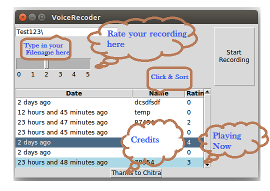

#			RECORDER APP FOR UBUNTU
--------------------------------------------------------------------------------------

## WHAT'S THE DEAL ?
----------------------
Its a dead-simple Recording application which helps you prepare for *speaking sessions* ,be it for interviews, lectures or even for recitals at school !I personally use it to practise my english for Toefl and for practising poerty recitals for my friend .
Do Check out the Screen Shots.

## FOR THE CURIOUS
----------------------------
Here is the snapshot of the app , for the curious

## FOR THE EXTRA CURIOUS
----------------------------
**pip install Recorder**

If you have the 'requried' packages [be extra extra curious to know about it :p ]
just clone it and type python app.py

## FOR THE EXTRA EXTRA CURIOUS
-----------------------------
It was written using **Tkinter** .(sorry for the 95-ish graphics , and its derivatives .
It uses port audio api (**PyAudio**) .
It also uses **Pickledb** for database maintainence.

## FOR THE EXTRA EXTRA EXTRA CURIOUS
---------------------
I did this because i did not find any decent apps in software center that records voice and stores them . without pesky other'business'es.
Hope other disgruntled users find solace here :)

----------------------------------------------------
###	Its okay to be curious :)
----------------------------------------------------
